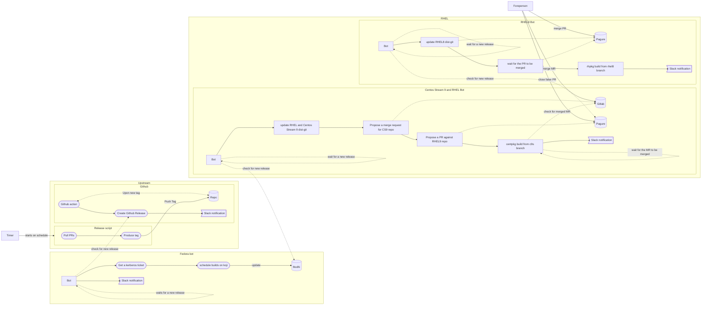

Maintainer Tools
=======

This repository hosts a collection of tools used by osbuild maintainers.

 - release.py
 - node_reservation.sh

## Release process

```mermaid
flowchart LR
    Foreperson -- merge MR --> gitlab
    Foreperson -- close false PR --> pagure
    Foreperson -- merge PR --> pagure8
    Timer-- starts on schedule --> Release
    subgraph Upstream
    subgraph Release [Release script]
        RS1([Pull PRs]) --> RS2([Produce tag])
    end
    subgraph Github [Github]
        GH2 --> GH3([Create Github Release])
        GH2([Github action]) <-. Upon new tag.-> GH1[(Repo)] 
        GH3 --> gslack>Slack notification]
    end
    RS2 -- Push Tag --> GH1
    end
    subgraph Fedora [Fedora bot]
        F1[Bot] -. waits for a new release .-> F1
        F1 --> kerb([Get a kerberos ticket])
        kerb --> fedpkg([schedule builds on koji])
        fedpkg -- update --> bodhi[(Bodhi)]
        F1 --> fslack>Slack notification]
    end
    subgraph RHEL
    F1 -. check for new release .-> GH3
    subgraph CS9 [Centos Stream 9 and RHEL Bot]
        CS91[Bot] -. wait for a new release .-> CS91
        CS91 --> CS92[update RHEL and Centos Stream 9 dist-git]
        CS92 --> CS93[Propose a merge request for CS9 repo]
        CS93 -.-> gitlab
        CS93 --> CS94[Propose a PR against RHEL9 repo]
        CS94 -.-> pagure[(Pagure)]
        CS95 -. wait for the MR to be merged .-> CS95
        CS94 --> CS95[centpkg build from c9s branch]
        CS95 -. check for merged MR .-> gitlab[(Gitlab)]
        CS95 --> cslack>Slack notification]
    end
    subgraph RHEL8 [RHEL8 Bot]
        RH81[Bot] -. wait for a new release .-> RH81
        RH81 --> RH82[update RHEL8 dist-git]
        RH82 -.-> pagure8[(Pagure)]
        RH82 --> RH83[wait for the PR to be merged]
        RH83 -.-> pagure8
        RH83 --> RH84[rhpkg build from rhel8 branch]
        RH84 --> rslack>Slack notification]
    end
    CS91 -. check for new release .-> bodhi
    RH81 -. check for new release .-> pagure
    end
```
